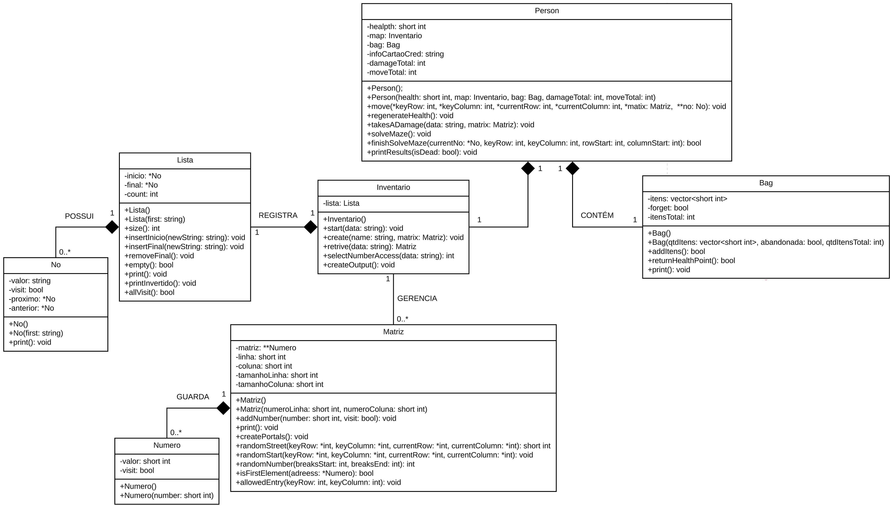

<section>   
    <h1>📢 AEDS: Labirinto Recorrente</h1>   
    

        Criado em Abril de 2023, o projeto <strong>Labirinto Recorrente</strong> foi desenvolvido em virtude de atender as demandas do curso de Algoritimo e Estrutura de Dados, ministrado pelo professor <a href="https://www.linkedin.com/in/michelpiressilva/?originalSubdomain=br" target="_blank">Michel Pires Da Silva</a> no Centro Federal de Educação Tecnológica de Minas Gerais (<a href="https://www.divinopolis.cefetmg.br/" target="_blank">CEFET-MG</a>).
    

</section>
<section>
    <h2>🛠 Problemática</h2>
    

        Após produzir um trabalho de aquecimento que envolvia o caminhamento em matrizes (<a href="https://github.com/LuanLuL/AEDS---Caminho-Guloso">AEDS: Caminho-Guloso</a>), está na hora de incluir nesse processo execuções mais elaboradas, as quais nos permita analisar o custo computacional de todo o processo. Nessa perspectiva, o problema do Labirinto Recorrente consiste em um personagem que se encontra perdido em um labirinto, o qual é compreendido por nós como sendo uma matriz cuja posição de sua localização é dada por um elemento (x, y) dentro dessa estrutura. 
    

    

        O objetivo principal do personagem é percorrer as matrizes até que o seu último caminho se torne zero. Ou seja, todos os elementos percorridos desde o elemento inicial até seu reencontro devem possuir o valor zero. No final é preciso apresentar como resultado: 
    

    <ol type="a">
        <li>Quantidade de casas que foram percorridas ao todo;</li>
        <li>A soma de itens consumidos pelo caminho completo;</li>
        <li>Quantidade de casas da matriz que ficaram sem serem exploradas;</li>
        <li>Quantidade de perigos enfrentados ao decorrer do percurso.</li>
    </ol>
</section>
<section>
    <h2>🚧 Regras</h2>
    

        Nesse labirinto existem dois elementos que devem ser tratados de formas diferentes. O primeiro elemento especial é a parede (#). As paredes bloqueiam os passos do personagem, fazendo com que a única opção seja desviar e continuar por outro percurso. Já o segundo elemento especial é chamado de armadilha (*). A cada armadilha atravessada pelo personagem, ele levará 1 de dano em um total máximo de 10 vidas. De resto, todos os outros elementos da matriz são considerados como possíveis trajetórias, as quais são valores numéricos positivos.
    

    

        Ao decorrer do percuso, a cada passo correto sob uma estrada, o personagem ganha um item, subtraindo esse do valor que compõe a posição (x, y) e gravando nessa o valor resultante. A cada subtração bem sucedida o item vai para um banco de vida que, quando cheio (a cada 4 itens), regenera 1 de vida para o personagem. Contudo, pode haver partes do caminho com zero itens, esses devem continuar sendo utilizados, porém, sem computar pontuação no banco de itens. 
    

    

        Caso o total de vidas venha a ser zero, o algoritimo deve considerar que o personagem morreu e finalizar o programa apresentando os resultados. Por fim, o personagem deve escolher o trajeto de forma aleatória. Em outras palavras, ele decide um elemento (x, y) arbitrariamente que esteja a sua volta e segue para ele se possível ou descarta caso seja uma parede.
    

    

        De modo geral, a intenção do problema não é encontrar uma saída, mas sim, tentar consumir o máximo possível de itens até zerar o caminho ou morrer tentando.
    

</section>
<section>
    <h2>✅ Solução proposta</h2>
    

        Depois de compreendido a problemática e suas respectivas regras, a estratégia de resolução apresentada se baseia em dividir o problema em partes. Primeiramente, é necessario criar uma estrutura organizada de armazenamento para as matrizes que formam o labirinto, na qual é empregado os conceitos da Orientação a Objetos. Em seguida é preciso estabelecer meios sucintos para efetivar a leitura, atualização e remoção das matrizes; uma classe foi desenvolvida para satisfazer essa demanda. Por último e mais importante, o personagem deve percorrer o labirinto até que uma das condições de parada seja alcançada. 
    

    

        <h3>💍 Engenharia do sistema</h3>
        

            A ferramenta utilizada para construção do sistema é  a linguagem de programação C++. Sendo orientada a objetos (POO), o C++ é usado tanto para comunicação em máquinas quanto para desenvolvimento de softwares acadêmicos e corporativos, jogos e entre outras coisas. Foi escolhida por ser considerada uma das linguagens de programação mais rapidas dos mundo e por possuir as funcionalidades de POO — <a href="https://cplusplus.com/doc/tutorial/" target="_blank">saiba mais</a>.
        

        

            Com o intuito de organizar e decifrar o labirinto, o sistema é composto por sete classes: <i>Lista</i>, <i>No</i>, <i>Numero</i>, <i>Matriz</i>, <i>Person</i>, <i>Bag</i> e <i>Inventario</i>. Observe mais na Figura 1.  
        

         
        

            
              <strong>Figura 1:</strong> Diagrama de classes do sistema
        

         
        

            Basicamente, a parte principal do software consiste em uma classe que realiza o gerenciamento de arquivos DATA e dois objetos com a finalidade de representar o personagem e o labirinto. As demais classes auxiliam nos métodos importantes do sistema, guardando e fornecendo informações.
        

        

            Sabe-se que os dados de entrada do labirinto são inseridos através do arquivo DATA <a href="https://github.com/LuanLuL/AEDS---Labirinto-Recorrente/blob/master/dataset/input.data">input.data</a>. Nesse sentido, o usuario tem a possibilidade de inserir matrizes do tamanho que desejar. Contudo, se ao acaso for introduzido matrizes muito grandes, o sistema pode apresentar erros ao tentar carregar um número excessivo de dados simultaneamente. Para solucionar essa dificuldade, a classe <i>Inventario</i> foi criada. Durante o processamento do algoritmo, está classe é responsável por separar as matrizes, de forma que apenas uma esteja alocada na memória do sistema por vez.
        

    

</section>
<section>
    <h2>🎞 Processamento</h2>
    

        Durante o deselvovimento do algoritimo apresentado nesse repositório, foi-se utilizado de três principais tecnologias: Visual Studio Code e WSL:Ubunto.
    

    <ul>
        <li>    
            

                O Visual Studio Code é um editor de texto multiplataforma disponibilizado pela Microsoft para o desenvolvimento de aplicações, Conhecer essa ferramenta é importante para os desenvolvedores que pretendem trabalhar em ambientes multiplataforma, por exemplo,  podendo operar o desenvolvimento em ambiente Mac e Linux, ao mesmo tempo em que mantém o projeto compatível com Windows. Segue em anexo o link para o site da plataforma — <a href="https://code.visualstudio.com/" target="_blank">Visual Studio Code</a>.
            

        </li>
        <li>
            
O WSL é um método para se executar o Sistema Operaciona Linux dentro do Windows de forma muito facil. Essa platoforma se torna essencial para o desenvovimento em ambiente GNU Linux, evitando tarefas como a intalação de maquinas vituais, criação de dual booting no computador pessoal e entre outras coisas. Além disso, existem diversas vantagens como rodar programas em conjunto e compartihamento de localhost. Segue em anexo um  tutorial de download do WSL2 — <a href="https://youtu.be/hd6lxt5iVsg" target="_blank">Tutorial WSL2</a>.

        </li>
    </ul>
    

        Por fim, o programa possui um arquivo Makefile que realiza todo o procedimento de compilação e execução. Para tanto, temos as seguintes diretrizes de execução:
    

    

        <table>
            <thead>
                <tr>
                    <th>Comando</th>
                    <th>Função</th>
                </tr>
            </thead>
            <tbody>
                <tr>
                    <td><code>make clean</code></td>
                    <td>Apaga a última compilação realizada contida na pasta build</td>
                </tr>
                <tr>
                    <td><code>make</code></td>
                    <td>Executa a compilação do programa utilizando o gcc, e o resultado vai para a pasta build</td>
                </tr>
                <tr>
                    <td><code>make run</code></td>
                    <td>Executa o programa da pasta build após a realização da compilação</td>
                </tr>
            </tbody>
        </table>
        

            <b>Tabela 1:</b> Comandos úteis para compilar e executar o programa de computador
        

    

</section>
<section>
    

    

          

           Feito por <strong>Luan Gonçalves Santos</strong>     
         

         

          
        
        

    

</section>

<!-- 

Organizando a matriz:

* == (-1)
# == (-2)
PORTAL PARA MATRIZ ANTERIOR == (-3) 
PORTAL PARA PROXIMA MATRIZ == (-4)                                          
-->